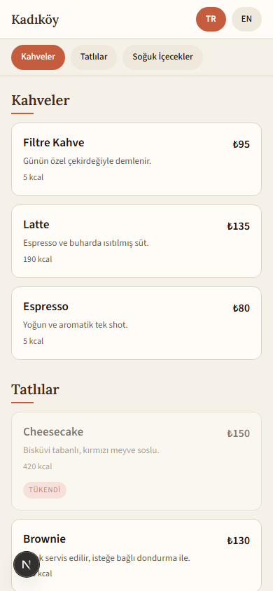
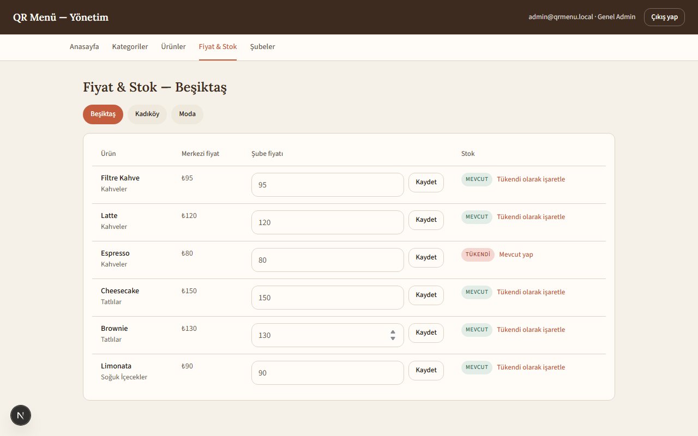

# QR Menü

Şubeye özel QR kodla açılan, çok dilli (TR/EN) dijital kafe menüsü ve yönetim paneli. Müşteri masadaki QR'ı okutur, o şubenin güncel fiyat/stok bilgisiyle menüsünü görür; kafe sahibi ve şube yöneticileri panelden içeriği anında günceller — baskı maliyeti ve bekleme yok.

## Ekran görüntüleri

| Public menü | Yönetim paneli — Fiyat & Stok |
|---|---|
|  |  |

## Özellikler

- **Public menü** (`/menu/[şube-slug]`) — kategorilere ayrılmış, fotoğraflı, mobil öncelikli menü; TR/EN dil seçici (seçim ziyaret boyunca hatırlanır, çevirisi olmayan içerik Türkçeye döner); isteğe bağlı kalori bilgisi ürünün altında gösterilir.
- **Merkezi katalog + şube bazlı override** — ürün/kategori tek yerden yönetilir; her şube kendi fiyatını ve stok durumunu (mevcut/tükendi) bağımsız ayarlayabilir.
- **Rol tabanlı yönetim** — `super_admin` (tüm şubeler + katalog) ve `branch_manager` (yalnızca kendi şubesi); yetki kontrolü sunucu tarafında da zorunlu kılınır.
- **Şube yönetimi + otomatik QR** — yeni şube eklendiğinde `/menu/[slug]` URL'sini kodlayan QR otomatik üretilir, PNG/SVG olarak indirilebilir.
- **Görsel yükleme** — ürün fotoğrafları doğrulanıp (JPG/PNG/WEBP, ≤5MB) VPS yerel diskine kaydedilir, `next/image` ile optimize sunulur.
- **Soft-delete** — şube ve ürünler kalıcı silinmez, pasife alınır veya (bağlı veri yoksa) sistemden gizlenir; geçmiş veri/QR bütünlüğü korunur.

## Teknoloji

Next.js 16 (App Router, TypeScript) · Prisma + SQL Server · Auth.js (NextAuth) credentials · Tailwind CSS v4 · Vitest · qrcode

## Başlarken

### Ön koşullar

- Node.js 20+
- Erişilebilir bir SQL Server örneği (yerelde Windows Authentication veya bir SQL login ile)

### Kurulum

```bash
npm install
cp .env.example .env
```

`.env` dosyasındaki `DATABASE_URL`, `AUTH_SECRET` ve `NEXT_PUBLIC_APP_URL` değerlerini kendi ortamınıza göre düzenleyin. `AUTH_SECRET` üretmek için:

```bash
node -e "console.log(require('crypto').randomBytes(32).toString('base64'))"
```

### Veritabanı

```bash
npm run prisma:migrate   # şemayı veritabanına uygular
npm run seed              # örnek şube/kategori/ürün verisiyle doldurur
```

Seed sonrası oluşan hesaplar:

| Rol | E-posta | Şifre |
|---|---|---|
| `super_admin` | `admin@qrmenu.local` | `ChangeMe123!` |
| `branch_manager` (Kadıköy) | `kadikoy@qrmenu.local` | `ChangeMe123!` |

### Geliştirme sunucusu

```bash
npm run dev
```

- Public menü: http://localhost:3000/menu/kadikoy
- Yönetim paneli: http://localhost:3000/admin/login

## Komutlar

| Komut | Açıklama |
|---|---|
| `npm run dev` | Geliştirme sunucusunu başlatır |
| `npm run build` | Production build alır |
| `npm start` | Production build'i çalıştırır |
| `npm run lint` | ESLint çalıştırır |
| `npm test` | Vitest test paketini çalıştırır |
| `npm run prisma:migrate` | Geliştirme migration'ı oluşturur/uygular |
| `npm run prisma:deploy` | Production'da bekleyen migration'ları uygular |
| `npm run seed` | Veritabanını örnek verilerle doldurur |

## Testler

`npm test`, Menü İçerik Yönetimi modülünü (kategori/ürün CRUD, şube bazlı fiyat/stok override çözümleme, dil fallback, geçersiz girdi reddi) ve yetkilendirme kuralını (`branch_manager` başka şubeyi düzenleyemez) gerçek bir test veritabanına karşı doğrular.

Testler `.env.test` dosyasındaki `DATABASE_URL`'i kullanır — geliştirme/production veritabanınızdan **ayrı** bir veritabanı gösterin, çünkü test paketi her çalıştırmada tüm tabloları temizler:

```bash
cp .env.test.example .env.test
# .env.test içindeki DATABASE_URL'i ayrı bir veritabanına yönlendirin
npx prisma migrate deploy   # test veritabanına şemayı uygular
npm test
```

## Proje yapısı

```
prisma/               şema, migration'lar, seed script'i
src/app/menu/[slug]/  public menü sayfası
src/app/admin/        yönetim paneli (kategori, ürün, fiyat/stok, şube, giriş)
src/app/api/          NextAuth route handler'ı, QR indirme endpoint'i
src/lib/menu/         çerçeveden bağımsız iş mantığı (okuma, mutasyonlar, doğrulama)
src/lib/authz.ts      sunucu taraflı yetkilendirme koruması
src/components/ui/    DESIGN.md'deki tasarım sistemine dayalı bileşenler
public/uploads/       yüklenen ürün fotoğrafları (yerel disk)
```

## Dağıtım

Uygulama Hostinger VPS üzerinde kendi alan adında HTTPS (Let's Encrypt) ile yayına alınmak üzere tasarlandı. Production'a alırken:

1. `.env` içindeki `DATABASE_URL`'i gerçek bir SQL login ile, `AUTH_SECRET`'i yeni üretilmiş bir değerle, `NEXT_PUBLIC_APP_URL`'i gerçek alan adıyla güncelleyin (QR kodları bu URL'den üretilir).
2. `npm run prisma:deploy` ile migration'ları uygulayın.
3. `npm run build && npm start`.
4. `public/uploads/` dizinini (yüklenen ürün fotoğrafları) düzenli yedeklere dahil edin.
